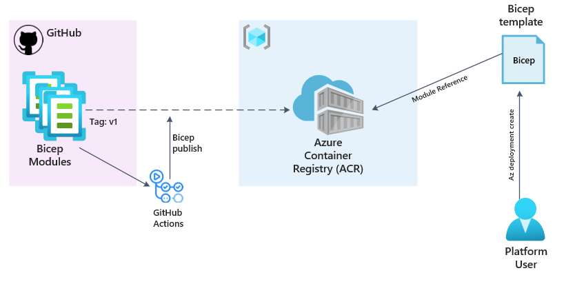

# Leveraging the a private registry for Bicep modules

<!-- markdownlint-disable MD033 -->
<div style="width: 400px; height: 400px; overflow: hidden;">
  
</div>
<!-- markdownlint-enable -->

## Introduction

Previously we introduced the concept of Bicep modules and how we can use them to break our solution into many related templates. This is a great way to reuse code and simplify our Bicep files but what if we want to share these modules with other people or teams?

If we look at the module below, we can see that it is using a module called `resourceGroupForNetwork` which is using a common bicep template for resource groups using the path in the repo to the template.

``` bicep
// Module: Resource Groups (Network)
module resourceGroupForNetwork '../CARML/resources/resource-group/main.bicep' = if (virtualNetworkEnabled) {
  name: 'resourceGroupForNetwork-${guid(deployment().name)}'
  scope: subscription(subscriptionId)
  params: {
    name: resourceGroups.network
    location: location
    tags: tags
  }
}
```

Imagine if we had multiple repos and wanted to share this module across all of them, we would need to copy the module to each repo. This is where the Bicep registry comes in. A Bicep registry is hosted on [Azure Container Registry (ACR)](https://learn.microsoft.com/en-us/azure/container-registry/container-registry-intro) and enables a central location where these modules can be hosted and then can be used by various consumers. The platform team would be responsible for publishing and updating these modules to the ACR as outlined in the diagram below.



To call the module, we will update the local path to that of the ACR, 

``` bicep
// Module: Resource Groups (Network)
module resourceGroupForNetwork 'br:<registry-name>.azurecr.io/bicep/modules/core/resourceGroup:v1' = if (virtualNetworkEnabled) {
  name: 'resourceGroupForNetwork-${guid(deployment().name)}'
  scope: subscription(subscriptionId)
  params: {
    name: resourceGroups.network
    location: location
    tags: tags
  }
}
```

You would replace `<registry-name>` with your ACR registry name, and `v1` with the version of the module you want to use. The version is optional and if not specified, the latest version will be used. Having the version allows you to pin to known working versions of the module.

To simplify the path for linking to modules, you can create aliases in the `bicepconfig` file. The config file has a property for *moduleAliases*. This property contains all of the aliases you define.

``` bicep 
  "moduleAliases": {
    "br": {
      "InsightRegistry": {
        "registry": "insightregistry.azurecr.io"
      },
      "CoreModules": {
        "registry": "insightregistry.azurecr.io",
        "modulePath": "bicep/modules/core"
      }
    }
  }
```

With the aliases, you can simplify the link by using the alias for the registry.

``` bicep
module resourceGroupForNetwork 'br:insightregistry/bicep/modules/core/resourceGroup:v1' = if (virtualNetworkEnabled) {
```

Or, you can simplify the link by using the alias that specifies the registry and the module path.

``` bicep
module resourceGroupForNetwork 'br:CoreModules:resourceGroup:v1' = if (virtualNetworkEnabled) {
```

## Conclusion

We have options to pull modules from a central location and share them with other teams using the private Bicep registry. This is a great way to share code and ensure that everyone is using the same version of the module. Local modules and the ACR can be used in the same Bicep file, so you can mix and match as needed so provides a lot of flexibility.

There is some overhead in managing the ACR and publishing the modules, but this can be automated using GitHub actions or Azure DevOps pipelines, however tomorrow we will look at another option and something that will extend on the above but take away the need to manage this.

### Further Reading

Some further reading on the topics covered in this post:

- [Share Bicep modules by using private registries](https://learn.microsoft.com/en-us/training/modules/share-bicep-modules-using-private-registries/)
- [Aliases using the Bicepconfig.json](https://learn.microsoft.com/en-us/azure/azure-resource-manager/bicep/bicep-config-modules)
- [Azure Bicep modules with Container Registry](https://arinco.com.au/blog/azure-bicep-modules-with-container-registry/)
