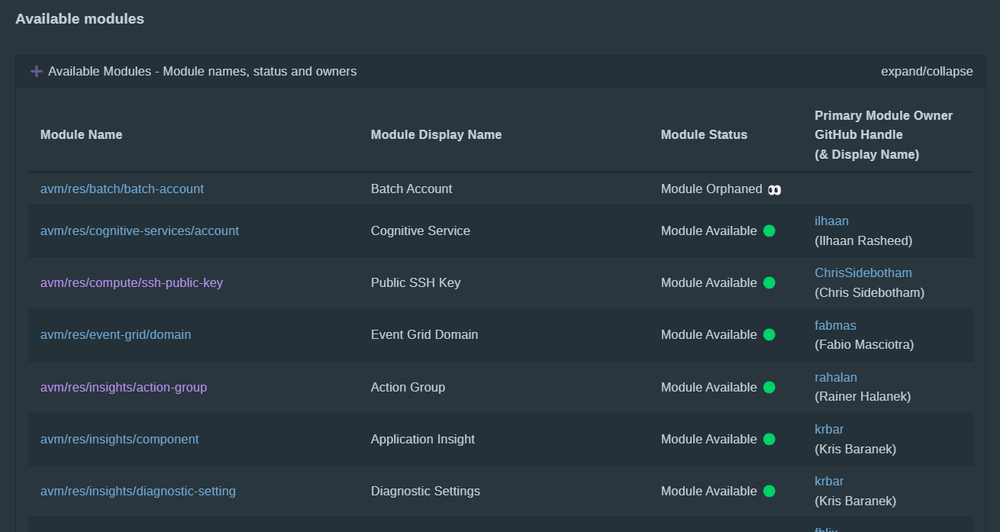
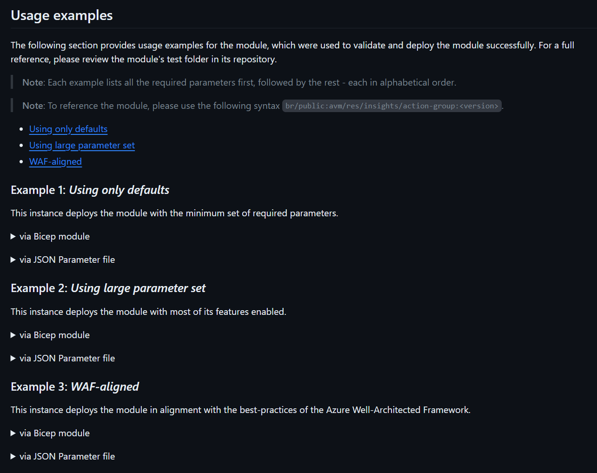

# The Future of Bicep Modules using Azure Verified Modules

<!-- markdownlint-disable MD033 -->
<div style="width: 400px; height: 400px; overflow: hidden;">
  
</div>
<!-- markdownlint-enable -->

## Introduction

In the previous post, we looked at how to consume a Bicep module from a centralised Private Bicep Registry using Azure Container Registry. In this post, we will look into something that is still in development, but will be IMO a game changer for consuming Bicep modules.

## Azure Verified Modules

Azure Verified Modules (AVM) is a new initiative to consolidate and define platform engineering standards for Infrastructure as Code. AVM is planned to be a common code base for initially Bicep and Terraform, that can be leveraged by *customers, partners and Microsoft*. The goal is to provide a consistent and reliable way to deploy Azure resources and services using Infrastructure as Code (IaC) and help accelerate consistent solution development.


AVM defines two module classifications, `Resource Modules` and `Pattern Modules`, that can be created, published, and consumed, these are defined further in the table below:

| Module Classification | Definition                                                                                                                                         | Who is it for?                                                                                                            |
|-----------------------|----------------------------------------------------------------------------------------------------------------------------------------------------|---------------------------------------------------------------------------------------------------------------------------|
| **Resource Module**   | Deploys a primary resource with WAF best practice configurations set by default, e.g., RBAC, Locks, Private Endpoints etc. (if supported).         | People that want to craft bespoke architectures that default to WAF best practices, where appropriate, for each resource. |
| **Pattern Module**    | Deploys multiple resources, usually using Resource Modules. They can be any size but should help accelerate a common task/deployment/architecture. | People that want to easily deploy patterns (architectures) using WAF best practices.                                      |

<br>


<br>
> [!NOTE]
> The information in this post is based on the current state of the initiative and is subject to change as Azure Verified Modules is still in development.

More details on the initiative, including the *What, Why and How* can be found at the offical [Azure Verified Modules](https://azure.github.io/Azure-Verified-Modules/) repository.

## Consuming Azure Verified Modules

The good news is the changes needed to consume these modules over local modules is minimal. The only change is the path to the module will be in the format of `br/<publisher>:<module-name>:<version>`. 

- Visit the [Bicep Resource Modules](https://azure.github.io/Azure-Verified-Modules/indexes/bicep/bicep-resource-modules/) page to see if the resource module is available. There is a table of `Available` and `Planned` modules.



- If the module is available, click on the module name to go to the dedicated page for that module. We are going to use the [Action Group](https://github.com/Azure/bicep-registry-modules/tree/main/avm/res/insights/action-group) module as an example.

- Each page has details on how to use and consume the module, examples and required and optional parameters.



So lets see how the Action Group module will look in the `main.bicep` file.

``` bicep
// Module: Action Group
module actionGroup 'br/public:avm-res-insights-actiongroup:0.1.1' = if (actionGroupEnabled && !empty(actionGroupEmails)) {
  name: 'actionGroup-${guid(deployment().name)}'
  scope: resourceGroup(subscriptionId, 'alertsRG')
  dependsOn: [
    sharedResourceGroups
  ]
  params: {
    location: 'Global'
    name: '${lzPrefix}${envPrefix}ActionGroup'
    groupShortName: '${lzPrefix}${envPrefix}AG'
    emailReceivers: [for email in actionGroupEmails: {
      emailAddress: email
      name: split(email, '@')[0]
      useCommonAlertSchema: true
    }]
  }
}
```

## Conclusion

Although this project is early days, the planning and thought that has gone into it is impressive. I am looking forward to seeing how this project evolves and how it will help accelerate the adoption of Bicep for Infrastructure as Code.

### Further Reading

Some further reading on the topics covered in this post:

- [Azure Verified Modules Overview](https://azure.github.io/Azure-Verified-Modules/)
- [Azure Verified Modules in GitHub](https://github.com/Azure/Azure-Verified-Modules/tree/main)
